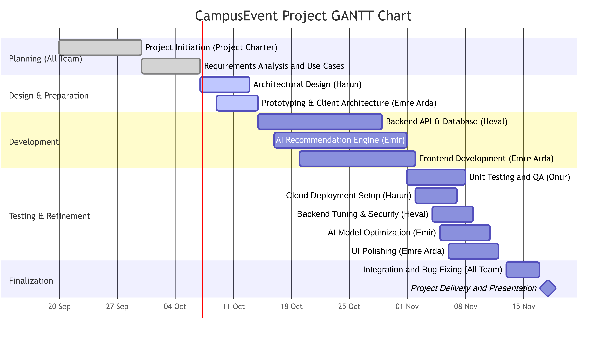
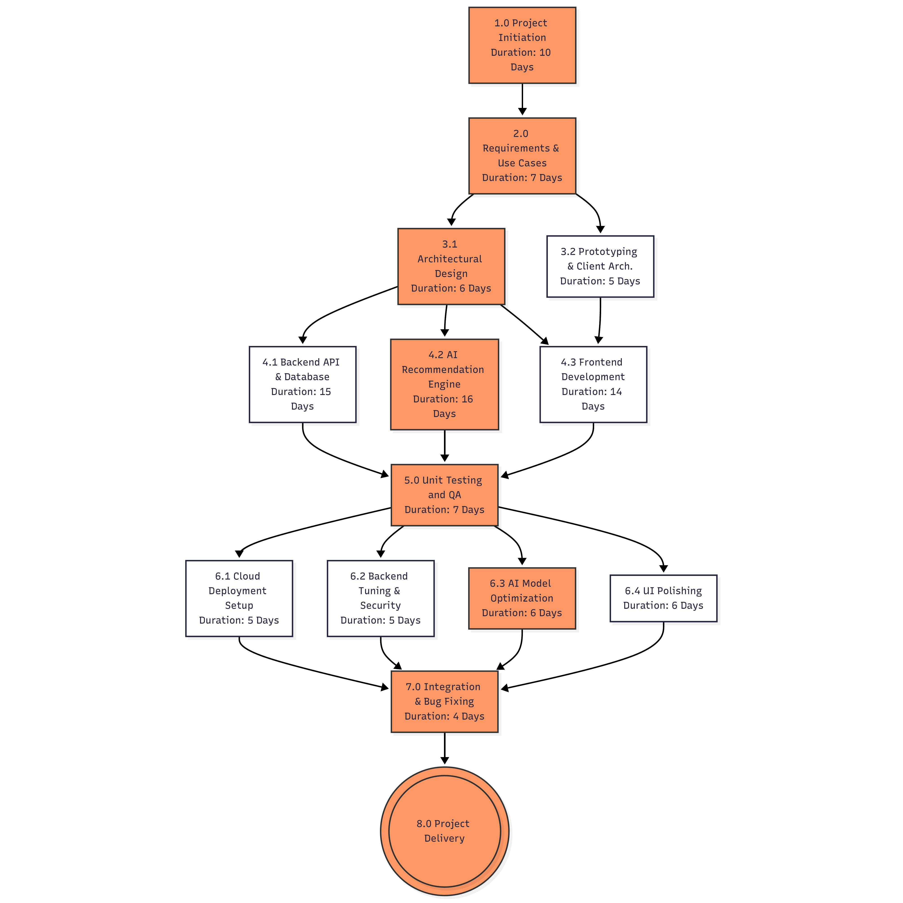

# CampusEvent – Project Plan Documents

| Document | File |
|---|---|
| Project Charter | [../CHARTER.MD](../CHARTER.MD) |
| Gantt chart | [gantt_chart.pdf](gantt_chart.pdf) · [PNG](gantt_chart.png) |
| PERT chart | [pert_chart.pdf](pert_chart.pdf) · [PNG](pert_chart.png) |

## Gantt Chart

## PERT Chart
Highlighted (orange) activities form the critical path:
1.0 → 2.0 → 3.1 → 4.2 → 5.0 → 6.3 → 7.0 → 8.0 (10 + 7 + 6 + 16 + 7 + 6 + 4 = **56 days**).

