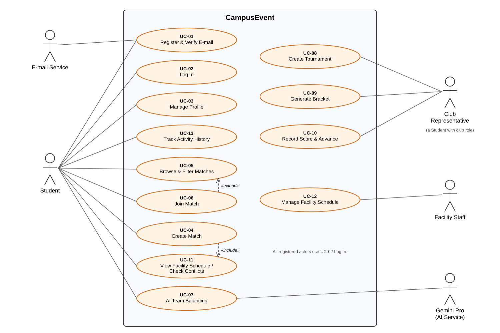

# CampusEvent – Use Cases

Requirements are written in **use case format**. Each use case has its own file and a matching test file under [`tests/`](../../tests).

| ID | Use Case | Primary Actor | Priority | Test |
|---|---|---|---|---|
| [UC-01](UC-01_register_and_verify.md) | Register with university e-mail and verify account | Student | High | [test](../../tests/test_uc01_register_and_verify.py) |
| [UC-02](UC-02_login.md) | Log in | All registered users | High | [test](../../tests/test_uc02_login.py) |
| [UC-03](UC-03_manage_profile.md) | Manage profile (sports, skill levels, availability) | Student | High | [test](../../tests/test_uc03_manage_profile.py) |
| [UC-04](UC-04_create_match.md) | Create match | Student | High | [test](../../tests/test_uc04_create_match.py) |
| [UC-05](UC-05_browse_and_filter_matches.md) | Browse and filter matches | Student | High | [test](../../tests/test_uc05_browse_and_filter_matches.py) |
| [UC-06](UC-06_join_match.md) | Join match | Student | High | [test](../../tests/test_uc06_join_match.py) |
| [UC-07](UC-07_ai_team_balancing.md) | AI skill-based team balancing | Student (organizer), Gemini Pro | Medium | [test](../../tests/test_uc07_ai_team_balancing.py) |
| [UC-08](UC-08_create_tournament.md) | Create tournament | Club Representative | Medium | [test](../../tests/test_uc08_create_tournament.py) |
| [UC-09](UC-09_generate_bracket.md) | Generate tournament bracket | Club Representative | Medium | [test](../../tests/test_uc09_generate_bracket.py) |
| [UC-10](UC-10_record_score.md) | Record score and advance teams | Club Representative | Medium | [test](../../tests/test_uc10_record_score.py) |
| [UC-11](UC-11_facility_availability.md) | View facility schedule and check conflicts | Student | High | [test](../../tests/test_uc11_facility_availability.py) |
| [UC-12](UC-12_manage_facility_schedule.md) | Manage facility schedule | Facility Staff | Medium | [test](../../tests/test_uc12_manage_facility_schedule.py) |
| [UC-13](UC-13_activity_history.md) | Track activity history | Student | Low | [test](../../tests/test_uc13_activity_history.py) |

The diagram is generated from [`diagrams/make_use_case_diagram.py`](diagrams/make_use_case_diagram.py).
